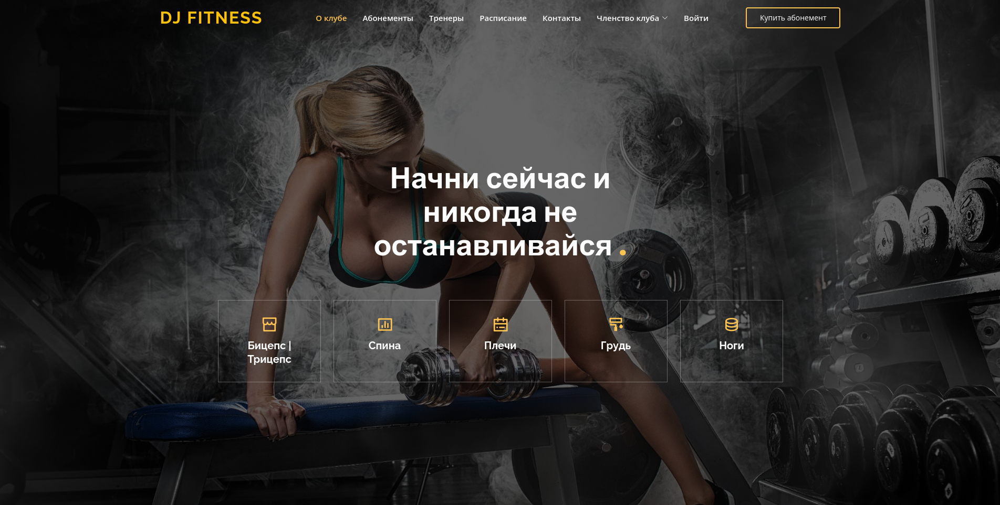
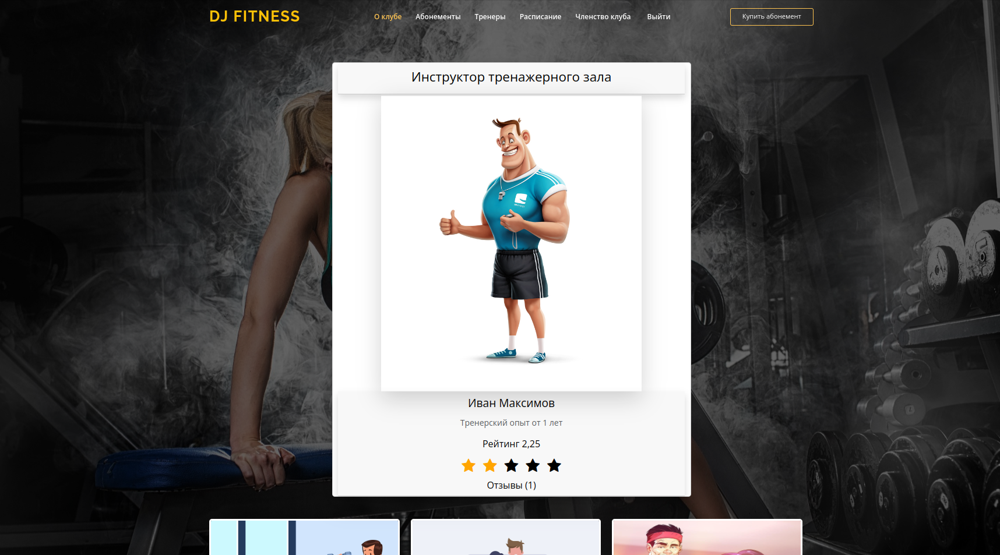

# Сайт Фитнес-клуба на Django

#### На сайте представлен следующий функционал   
> - Спортивные статьи
   
> - Детальная информация о тренере
   
> - Оформление абонемента и персональной тренировки с тренером
   

## Инструменты
> 
   - Python
   - Django
   - JavaScript
   - Bootstrap5
   - PostgreSQL
   - Celery
   - Redis
   - Docker

<i>Список задач</i>

<ul>
   <li>Переопределить модель User</li>
   <li>Регистрация по email</li>
   <li>Верификация по email</li>
   <li>Работа с обратной связью и подписка на рассылку</li>
   <li>Представление для профиля тренеров</li>
   <li>Оставить отзыв о тренере</li>
   <li>Оставить отзыв на другой комментарий</li>
   <li>Удаление комментария</li>
   <li>Оформление абонемента</li>
   <li>Оформление персональной тренировки</li>
   <li>Создание расписания для каждого тренера</li>
   <li>Новое приложение постов</li>
   <li>Функции добавления лайка или дизлайка к посту</li>
   <li>Добавить рейтинг тренеру</li>
   <li>Подключение HTMX</li>
   <li>Установка CK-EDITOR для работы с постами</li>
   <li>Подключение Stripe для оплаты абонемента</li>
   <li>Подключение webhook</li>
   <li>Покупка абонемента</li>
   <li>Покупка персональной тренировки</li>
   <li>Работа с фикстурами</li>
   <li>Подключение Celery и Redis</li>
   <li>Подключение Postgres</li>
   <li>Асинхронная отправка писем при заполнении формы обратной связи</li>
   <li>Асинхронная отправка писем при подписке на рассылку</li>
</ul>

