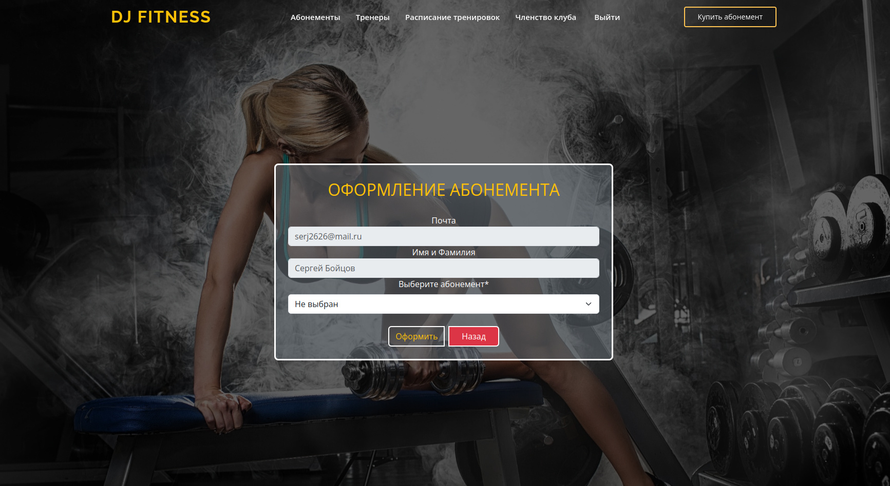

# Сайт Фитнес-клуба на Django

# Возможности   
> -   На сайте представлены спортивные статьи
   
> -   Оформление абонемента с последующей оплатой
  
> -   Оформление персональной тренировки с тренером
  

## Инструменты
> 
   - Python
   - Django
   - JavaScript
   - Bootstrap5
   - Celery
   - Redis
   - Docker

### Задачи

 - [x] Переопределить модель User
 - [x] Регистрация по email
 - [x] Верификация по email
 - [x] Работа с обратной связью и подписка на рассылку
 - [x] Представление для профиля тренеров
 - [x] Оставить отзыв о тренере
 - [x] Оставить отзыв на другой комментарий
 - [x] Оформление абонемента
 - [x] Оформление персональной тренировки
 - [x] Новое приложение постов
 - [x] Функции добавления лайка или дизлайка к посту
 - [x] Установка CK-EDITOR для работы с постами
 - [ ] Подключение Stripe для оплаты абонемента
 - [ ] Покупка абонемента
 - [ ] Покупка персональной тренировки
   * Подкдючение через Docker
      - [ ] Подключение Celery и Redis
      - [ ] Подключение Postgres
 - [ ] Асинхронная отправка писем

